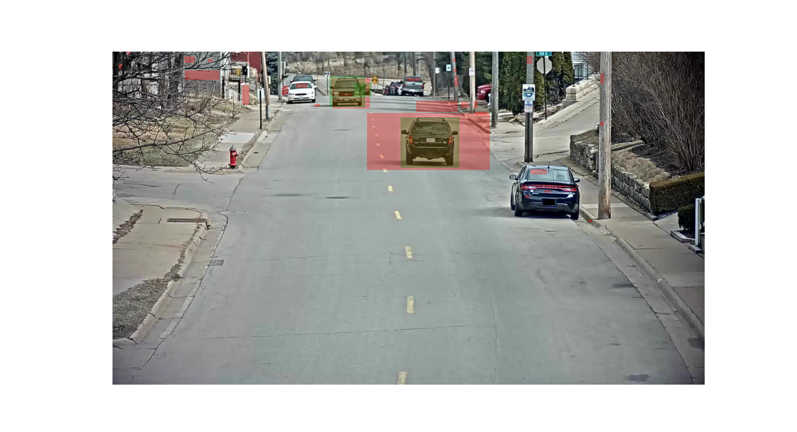
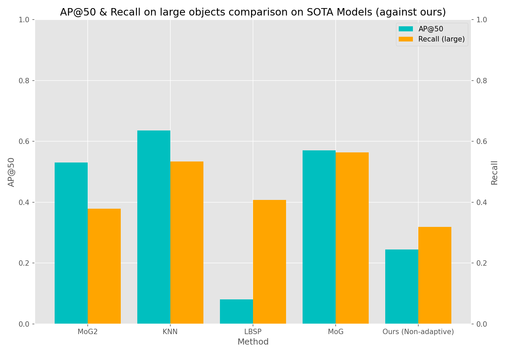

# Week 2: Background estimation

## Task overview

### Task 1: Gaussian modelling for background estimation

The task is implemented in [```t1.py```](./t1.py).

This task consists on the implementation of a simple single-gaussian background
estimation model. In our code, this is written in the script file
[```background_estimation.py```](./background_estimation.py), specifically the
class ```StillBackgroundEstimatorGrayscale```. To train an instance of this
model, one should run the following

```python
from background_estimation import StillBackgroundEstimatorGrayscale
from data import FrameLoader
from pathlib import Path

path = Path(...)
train_loader = FrameLoader(path, perc, partition) # See implementation for details

estimator = StillBackgroundEstimatorGrayscale(train_loader, tol)
estimator.fit()
```

For inference one should run

```python
output_mask = estimator.predict(rgb_image)
```

This output mask may be refined using the ```cleanup_mask()``` function, which
performs median filtering and some morphology. To obtain bounding boxes, run
```get_bboxes()``` on a mask output.

It should be noted this implementation will load the entire video on memory and
compute statistics from it, hence using a limited amount of frames is
recommended (we considered using running statistics for this, but since the
number of frames so happens to fit in our machines we kept it as is).

The following image shows an example prediction on frame 1617 of the provided
video sequence (S03 - c010) from the AI Cities dataset.



---

### Task 2: Adaptive Models

todo

---

### Task 3: State-of-the-art models

We found several resources from which to acquire interesting background
subtraction algorithms.

- [Review on background subtraction (2014)](https://d1wqtxts1xzle7.cloudfront.net/48563183/cviu2014sobral-with-cover-page-v2.pdf?Expires=1647912570&Signature=eBAVsFm93Xn~zMnL-xb-WeZrwcVflrN4~qPAenLDE8EdodZxmSJpxmSh2J66cvZQUwAdXMlmtOtcqskHYzCjbPBnhuZH61fvz95Q9TzkJQt~abRGysyfsBNDpiQ-OT0sFB6RCKfKzJNCf35ELKsZUcYDBtR3UAja10Bh2SNFAWWzrjuhidsRmltKm~fKS-4YUQgDRCPGxxbiBF-h8iB9PkgGkXnmFx1CiV9FgTA6fTGp8wISy1c4heyyz66JBGyfdIRpNSWFewKMADOd9outTPyVChGTJ~pbeh0GCyh3L4LvoRkCLNzvP3Ee4BrCul93DMHxDR3AmOngwEhEf7sLLQ__&Key-Pair-Id=APKAJLOHF5GGSLRBV4ZA).
- [Background subtraction library](https://github.com/andrewssobral/bgslibrary).
- [Review on Mixture of Gaussians Foreground Detection (2008)](https://hal.archives-ouvertes.fr/hal-00338206/document)
- [Understanding Gaussian Mixture Models for Foreground Segmentation (2002)](https://www.cse.psu.edu/~rtc12/CSE586Spring2010/papers/emBGsubtractAboutSandG.pdf)
- [Tutorial on OpenCV](https://docs.opencv.org/4.x/d1/dc5/tutorial_background_subtraction.html)

We tried building the library in point 2 but could not CMake it work (haha).
Therefore we settled with those methods we saw in the review paper at the first
point that were available in the OpenCV-contrib package.

Below, the method comparison and the results we obtained.



---

### Task 4: Color-based Models

todo